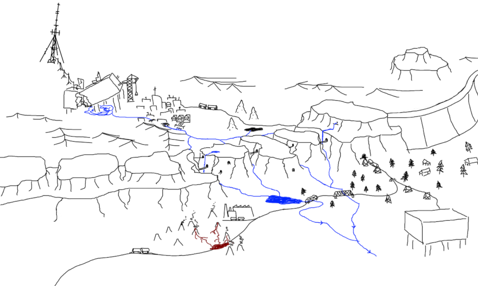
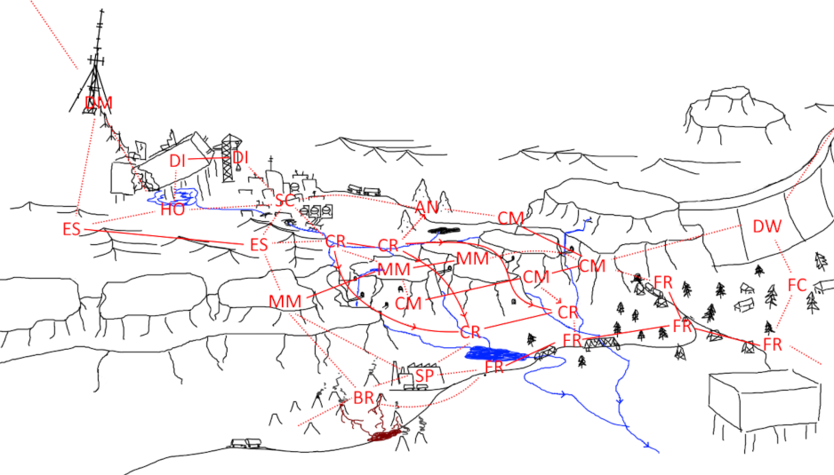
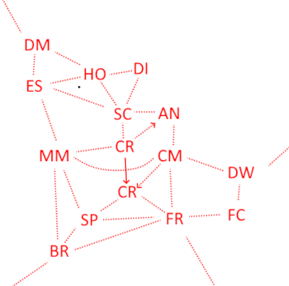

# rw_sand

## Regions

- TDI (Desert Iterator) - Iterator wreckage inner rooms
- TSC (Sandstone City) - Ground city remnants
- TDM (Dune Mast) - Communication tower
- THO (Hidden Oasis) - Oasis under the iterator
- TES (Endless sands) - Way to the complex from mesa mountains
- TAS (Active station) - Train yard, that was supplying iterator construction
- TRM (Mesa Mountains) - Mesa mountains, separating dunes from the rest of the world
- TCM (Coal Mines) - Ancient coal mines under mesa mountains
- TBR (Basalt Rocks) - Way to the mesa mountains from other local iterators group (way from SS, LTTM, SRS, NSH group)
- TAN (Antlion nest) - Deep underground grunt nest
- TCR (Canyon River) - Canyon that flows through mesa mountains
- TSP (Sulfur Processing) - Facility that process sulfur minerals near taBR location
- TFR (Forest rails) - Rail connections outside of mesa mountains
- TFC (Fir Cabin) - Small cabin settlement between fir trees
- TDW (Dust Wall) - Wall that keeps desert dust from going further south
  

## Enemies

### Sand shark

(Inspired by Nayaka Trawler from DRG. In a species family of antlions.)
Really fast creature, that moves in the sand like through a water. Appearance - long worm with a ton of fins to dig the sand. Way to outplay - stand on rocks.

### Antlion Burier

(In a species family of antlions.)
Antlion, catches a prey that falls to its sand funnel. If a pray tries to jump over - it launches itself trying to catch it mid-flight. Really low mobility, but instant kill of a caught pray.
Way to outplay - lure it to jump out of funnel, by throwing some big objects (larger that a rock or a spear) - snails, noodleflies, killed squidcadas, etc.

### Antlion Grunt

(In a species family of antlions.)
Overgrown ants, that live in colonies. Neutral by default (the whole room is aggravated), always aggressive in TAN region. Can be traded with for spears and some valuables, in exchange of food.
Uses sounds to communicate with other grunts. If killed before a screech - other grunts won't know about the issue (until they stumble upon a body).

### Fruit mimic

(In same species family as grappling worm.)
Parasitic creature that mimics blue fruits. Is different from regular blue fruits by its slim stem - it is a long dark tongue actually.

When eaten alive - starts digesting a host from inside (when hunger bar reaches 0 - hosts dies shortly). The way to neutralize it is by eating a puffer-fruit or standing in its cloud.

### Ceiling leech

(Inspired by cave leech from DRG. In same species family as stowaways.)
Stealthy static ceiling bug that tries to reach to its pray with it's long tongue. Unlike stowaways, they have motion vision and are actively trying to reach for their prey.

### Wasps, bees, etc

(Inspired by Deeptora species family from DRG)

## References

<https://music.youtube.com/watch?v=Z-Yme-FC658> - sound for FR region (#1).
<https://music.youtube.com/watch?v=XDq_e-kgGM4> - sound for FR region (#2).
